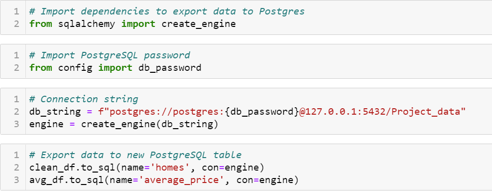

# Deliverable 1:
## Project Overview
In the following project, we will survey and forecast urban development using housing and permit data from the Austin metropolitan area. Specifically, we want to determine which regions of the Austin metro are undergoing the most rapid growth. We gravitated towards the topic because of the recent explosion in development that has enveloped the city of Austin. We want to determine which methods will provide us the best insights to address our findings to stakeholders such as real estate investors and city planners. We will be using home listing data from Zillow along with permit data from the city of Austin to assess which homes are more likely to rapidly appreciate based on the explosion of building permits in certain areas of the city. We will attempt to answer which zip codes are undergoing the most rapid development and how we can use this data to make smarter investments in the future. 

## Communication Protocols
We will be using slack to create a group thread to communicate our progress, findings, and roadblock we may encounter throughout the project. We plan on communicating every other day through slack as a check-in to make sure everyone is staying on track. If a group member runs into any trouble, they are encouraged to post immediately to resolve issues promptly. Although we plan on having check-ins every other day, we are encouraging members to check the slack thread daily just in case any problems arise.

## Database

<h3 align="center"> Provisional ERD </h3>

 

- NOTE: Provisional ERD is subject to change

The ERD shows the columns that remain from the datasets that we explored with pandas. The average price table was created using the groupby method and the mean function on the Zillow data to show the average home price by zip code. We expect the ERD to change regarding the number of necessary tables and relationships as we continue to explore our data.

After creating the ERD, we created a provisional database in pgAdmin to house the data we explored. The following image display the connection string used to load the data from the Jupyter notebook to Postgres:

<h3 align="center"> Provisional Database </h3>

 

The resulting queries highlight the successful database integration:

<h3 align="center"> Provisional Database </h3>

 

<h3 align="center"> Provisional Database </h3>

 

