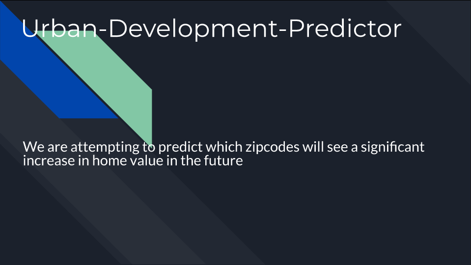
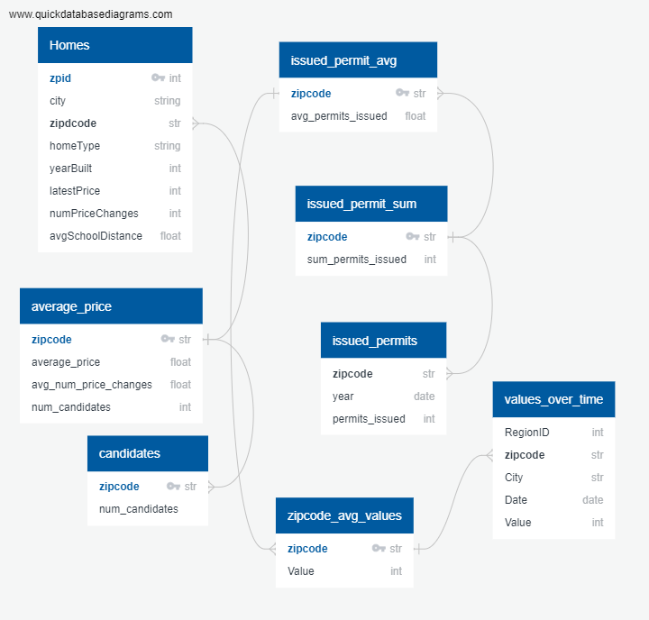
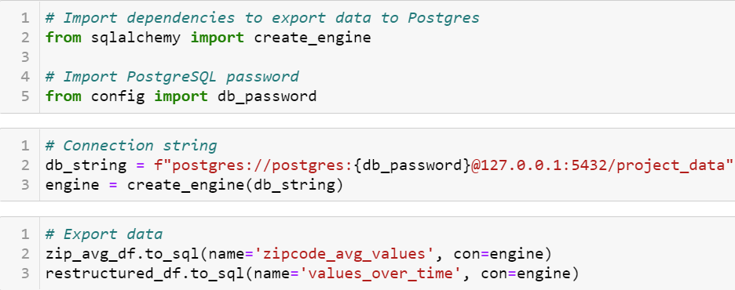
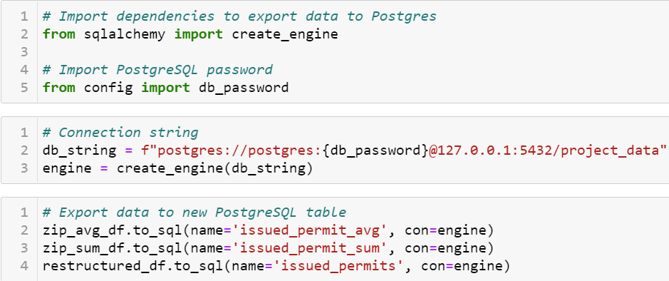
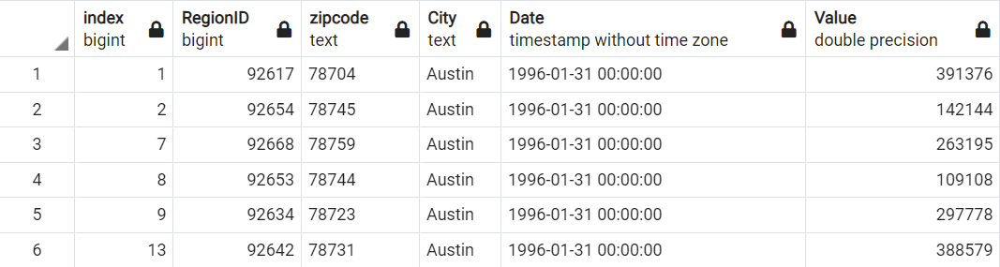
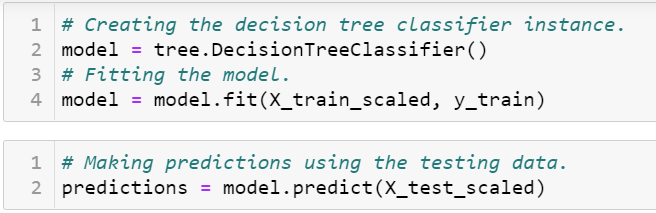

# Urban Development Predictor
## Project Overview
In the following project, we will survey and forecast urban development using housing and permit data from the Austin metropolitan area. Specifically, we want to determine which regions of the Austin metro are undergoing the most rapid growth. We gravitated towards the topic because of the recent explosion in development that has enveloped the city of Austin. We want to determine which methods will provide us the best insights to address our findings to stakeholders such as real estate investors and city planners. We will be using home listing data from Zillow along with permit data from the city of Austin to assess which homes are more likely to rapidly appreciate based on the explosion of building permits in certain areas of the city. We will attempt to answer which zip codes are undergoing the most rapid development and how we can use this data to make smarter investments in the future. 

## Communication Protocols
We will be using slack to create a group thread to communicate our progress, findings, and roadblock we may encounter throughout the project. We plan on communicating every other day through slack as a check-in to make sure everyone is staying on track. If a group member runs into any trouble, they are encouraged to post immediately to resolve issues promptly. Although we plan on having check-ins every other day, we are encouraging members to check the slack thread daily just in case any problems arise.

## Presentation
[Google Slides Presentation](https://docs.google.com/presentation/d/e/2PACX-1vToSjA4FsDQd7r8Lfb7Wp3v1eNIXDADtUv7blib3t4OJ1eGe8hckvWYvLF6YVf44Caw6iTofS1euhOk/pub?start=false&loop=true&delayms=30000)  

## Database

<h3 align="center"> ERD </h3>

 

The three CSV tables used throughout our project required tremendous amounts of preprocessing before we could export them to PostgreSQL: 
- Zillow home listing CSV
  - The home listing dataset was in the best conditions in terms of formatting and consistency.
  - Two summarized tables were created and exported with the original table after processing.
  - tables: homes, candidates, average_price
- Permit CSV
  - The permit CSV was wide data; processing required condensing the table to a long format to establish connections with other tables.
  - Two other summarized tables were also created and exported with the original.
  - tables: issued_permits, issued_permit_avg, issued_permit_sum
- Zillow home value index CSV
  - Similar processing as permit data and exported with a summarized table
  - tables: values_over_time, zipcodes_avg_values

### Database Tools
- PostgreSQL → Relational Database implemented
- Pandas → Data processing & Transformation
- SQLALchemy → Exporting data from pandas to PostgreSQL

After creating the ERD, we created a database in pgAdmin to house the data we explored. The following images display the connection strings used to load the data from the Jupyter notebooks to Postgres:

<h3 align="center"> Connection String </h3>

 

<h3 align="center"> Connection String </h3>

 

<h3 align="center"> Connection String </h3>

 

After successfully loading the data from the Jupyter notebooks to PostgreSQL with the help of pandas and SQLAlchemy, we manually altered each table to establish the the relationships among the tables. 

<h3 align="center"> Homes Table </h3>

 

<h3 align="center"> Values over Time Table </h3>

 

<h3 align="center"> SQL INNER JOIN </h3>

 

## Provisional Machine Learning Model

Our provisional machine learning model will attempt to predict the outcome column of the Zillow data frame. The outcome column was created and displays a one if the property is located in a rapidly growing region of the city. Otherwise, the column will display a zero for properties that are not considered to be in rapidly growing areas. The outcomes are provisional and subject to change as well since we have not completed a robust analysis to determine which properties are actually in rapidly developing areas. Nonetheless, we wanted to assess the viability of our model using dummy data. Using scikit-learn, our provisional model uses a decision tree to predict the outcome of each row of our data frame. Considering most of the columns from the Zillow data are categorical, the first step was encoding the columns that contained categorical variables:

<h3 align="center"> Encoding </h3>

 

From there, we followed the supervised learning workflow of separating the target and features, splitting the data, fitting the model, and then assessing the model performance:

<h3 align="center"> Splitting Target and Features </h3>

 

<h3 align="center"> Fitting the Model </h3>

 

<h3 align="center"> Assessing Performance </h3>

 

Our provisional model appears to have symptoms of overfitting, which we will address as we continue to tweak our datasets and the model itself. 
