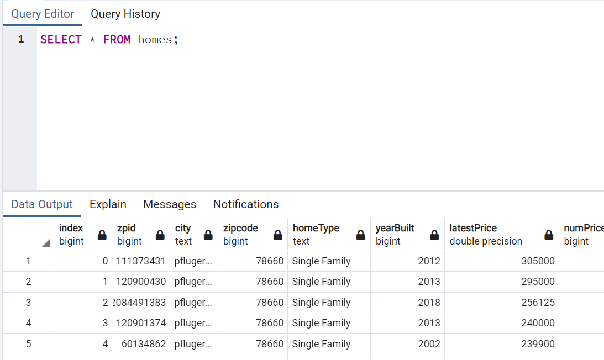

# Urban Development Predictor
## Project Overview
In the following project, we will survey and forecast urban development using housing and permit data from the Austin metropolitan area. Specifically, we want to determine which regions of the Austin metro are undergoing the most rapid growth. We gravitated towards the topic because of the recent explosion in development that has enveloped the city of Austin. We want to determine which methods will provide us the best insights to address our findings to stakeholders such as real estate investors and city planners. We will be using home listing data from Zillow along with permit data from the city of Austin to assess which homes are more likely to rapidly appreciate based on the explosion of building permits in certain areas of the city. We will attempt to answer which zip codes are undergoing the most rapid development and how we can use this data to make smarter investments in the future. 

## Google Slides

 [Click here to view our Google Slides presentation:](https://docs.google.com/presentation/d/e/2PACX-1vToSjA4FsDQd7r8Lfb7Wp3v1eNIXDADtUv7blib3t4OJ1eGe8hckvWYvLF6YVf44Caw6iTofS1euhOk/pub?start=false&loop=true&delayms=5000)  
 

## Communication Protocols
We will be using slack to create a group thread to communicate our progress, findings, and roadblock we may encounter throughout the project. We plan on communicating every other day through slack as a check-in to make sure everyone is staying on track. If a group member runs into any trouble, they are encouraged to post immediately to resolve issues promptly. Although we plan on having check-ins every other day, we are encouraging members to check the slack thread daily just in case any problems arise.

## Provisional Database

<h3 align="center"> Provisional ERD </h3>

 

- NOTE: Provisional ERD is subject to change

The ERD shows the columns that remain from the datasets that we explored with pandas. The average price table was created using the groupby method and the mean function on the Zillow data to show the average home price by zip code. We expect the ERD to change regarding the number of necessary tables and relationships as we continue to explore our data.

After creating the ERD, we created a provisional database in pgAdmin to house the data we explored. The following image display the connection string used to load the data from the Jupyter notebook to Postgres:

<h3 align="center"> Provisional Database </h3>

 

The resulting queries highlight the successful database integration:

<h3 align="center"> Query 1 </h3>

 

<h3 align="center"> Query 2 </h3>

 

## Provisional Machine Learning Model

 - The preliminary data included columns that describe the amount of permits, latest price, number of price changes, year built, zipcode of homes, etc.
 - After connecting to the database, we printed out the header for each column to see all of the features available, then chose the features that we believed would have the highest correlation to increased home prices per zip code.
 - The data was split into training and test data using the train_test_split function. We used the 75% to 25% default split.
 - We have decided to use the logistic regression model for our machine learning model. We grouped our data into two categories candidate or non candidate for investing. The benefit of this model is that it can be used to predict our binary outcome.

Our provisional machine learning model will attempt to predict the outcome column of the Zillow data frame. The outcome column was created and displays a one if the property is located in a rapidly growing region of the city. Otherwise, the column will display a zero for properties that are not considered to be in rapidly growing areas. The outcomes are provisional and subject to change as well since we have not completed a robust analysis to determine which properties are actually in rapidly developing areas. Nonetheless, we wanted to assess the viability of our model using dummy data. Using scikit-learn, our provisional model uses a decision tree to predict the outcome of each row of our data frame. Considering most of the columns from the Zillow data are categorical, the first step was encoding the columns that contained categorical variables:

<h3 align="center"> Encoding </h3>

 

From there, we followed the supervised learning workflow of separating the target and features, splitting the data, fitting the model, and then assessing the model performance:

<h3 align="center"> Splitting Target and Features </h3>

 

<h3 align="center"> Fitting the Model </h3>

 

<h3 align="center"> Assessing Performance </h3>

 

Our provisional model appears to have symptoms of overfitting, which we will address as we continue to tweak our datasets and the model itself. 
